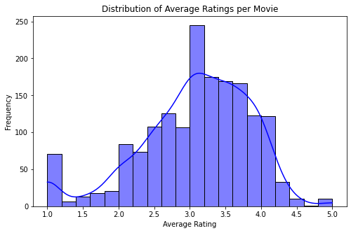
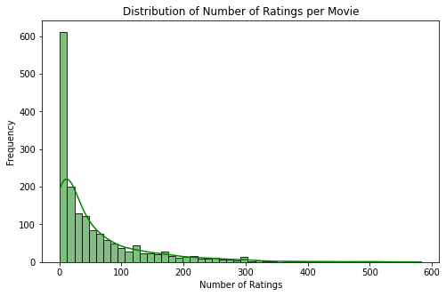
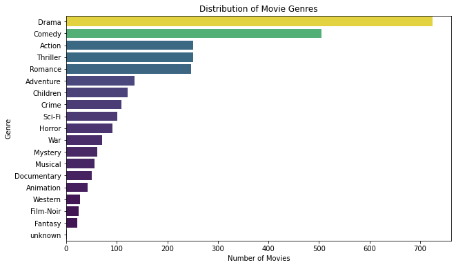

# Movie Recommendation System (MovieLens 100K Dataset)

## Project Overview
The goal of this project is to build a recommendation system that provides top 5 movie recommendations to users based on their ratings of other movies. The system uses Collaborative Filtering as the primary method, with Matrix Factorization (SVD) to capture latent factors in the user-item interaction data. The model is evaluated using RMSE, and the results are compared to a baseline model that predicts the global average rating.

## Problem Statement

Finding the right movie can be overwhelming for users, leading to frustration and disengagement. Personalized recommendation systems address this by analyzing past preferences to suggest relevant content, enhancing user experience and satisfaction.

For streaming platforms, these recommendations boost watch time and reduce churn, leading to higher customer retention and increased revenue. By keeping users engaged with tailored content, platforms strengthen their competitive edge.

Marketing teams also benefit by leveraging user data for targeted campaigns, increasing ad effectiveness and conversion rates.

Key **stakeholders**—users, streaming platforms, and marketing teams—all gain from personalized recommendations. Users enjoy relevant suggestions, platforms improve engagement, and marketers create more impactful promotions. Ultimately, these systems drive user satisfaction, business growth, and a better streaming experience.

## Dataset Description
The project uses the MovieLens 100K dataset, which contains:

- 100,000 ratings from 943 users on 1,682 movies.

- Movie metadata, including titles, genres, and release dates.

- User-generated tags (optional for this project).

The dataset is available from the GroupLens Research Lab (https://grouplens.org/datasets/movielens/100k/).

**Dataset Files:**
- u.data → User ratings (user_id, movie_id, rating, timestamp).
- u.item → Movie metadata (movie_id, title, genres, release date, IMDb link).
- u.user → User demographics (user_id, age, gender, occupation).

## Methodology
The project follows these steps:

## 1. Data Understanding

## 2. Exploratory Data Analysis (EDA)
Before training the model, we analyzed the dataset using visualizations:

### Rating Distribution

### Average Rating Per Movie

### Number of Ratings per Movie

### Distribution of Gernres

## 3. Data Preparation:

- Handle missing values in the dataset.
- Convert the release_date column to a datetime format.
- Merging the Ratings and Movie Datasets
- Convert Timestamp to reasonable date.
- Normalize Ratings
- Split the data into training and testing sets (80% train, 20% test).

## 4. Modeling
I implemented three recommendation approaches:

🔹 1. Popularity-Based Recommendation
Recommends most highly-rated movies based on average ratings.
Limitation → Not personalized (same for all users).

🔹 2. Collaborative Filtering

(a) User-Based CF

Finds similar users and recommends movies they liked.
Challenge → New users get no recommendations (cold start problem).

(b) Item-Based CF (Selected Model)

Finds similar movies based on past ratings.
More stable than User-Based CF.

(c) Content-Based CF

Recommends movies similar to those a user has liked.It works well for users with few ratings but requires detailed movie metadata.

TF-IDF Vectorization on movie genres

Cosine Similarity to find movies with similar genre profiles

🔹 3. Matrix Factorization Using SVD (Final Model)

- Singular Value Decomposition (SVD) decomposes the user-movie interaction matrix into latent factors, improving recommendation accuracy.

- Hyperparameter tuning optimizes n_factors, n_epochs,lr_all, reg_all to reduce errors.

## Model Evaluation and Insights
We assessed different recommendation models using Root Mean Squared Error (RMSE) to measure accuracy. Lower RMSE values indicate better predictions.

Mean Squared Error (RMSE) and Mean Absolute Error (MAE). These metrics help measure the accuracy of predicted ratings compared to actual user ratings. A lower RMSE and MAE indicate better performance, as they reflect smaller differences between predicted and real user preferences.

The evaluation results reveal distinct strengths and weaknesses among the models tested. The popularity-based model, which recommends movies based on overall popularity rather than individual preferences, had the highest RMSE (1.12) and MAE (0.85). While simple to implement, it lacks personalization, leading to lower accuracy in recommendations.
